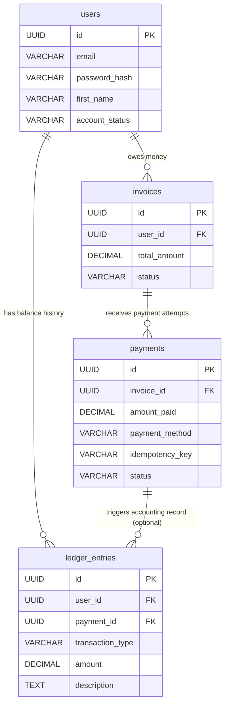

# Enterprise Gym Platform - Database Schema

This document outlines the strict BCNF (Boyce-Codd Normal Form) database schema for the financial core of the Gym System.

## Entity-Relationship (ER) Diagram

## Architectural Notes (The "Bank-Worthy" Features)
* **Idempotency (`payments`):** Uses a `UNIQUE` constraint on `idempotency_key` to prevent double-charging users during network retries.
* **Immutable Ledger (`ledger_entries`):** Protected by a PostgreSQL Trigger that actively blocks any `UPDATE` or `DELETE` commands, ensuring a strict append-only financial audit trail.
* **Referential Integrity:** `ON DELETE RESTRICT` guarantees that users with financial history cannot be accidentally deleted from the system.
