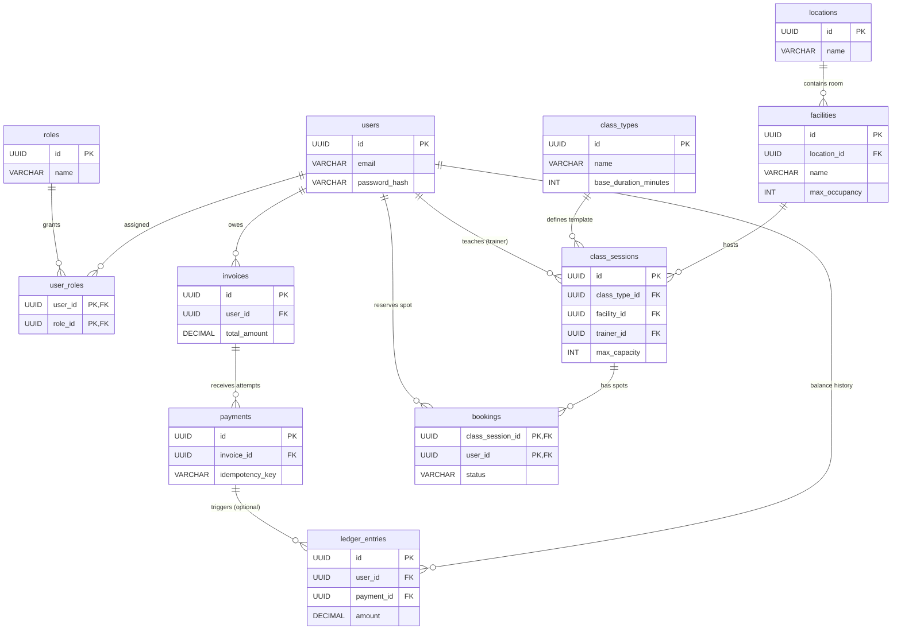

# Enterprise Gym Platform - Database Schema

This document outlines the strict BCNF database schema for the core modules of the Gym System.

## Entity-Relationship (ER) Diagram (Domains 1, 2, and 3)

## Architectural Notes (The "Bank-Worthy" Features)
* **Idempotency (`payments`):** Uses a `UNIQUE` constraint on `idempotency_key` to prevent double-charging users during network retries.
* **Immutable Ledger (`ledger_entries`):** Protected by a PostgreSQL Trigger blocking `UPDATE`/`DELETE`, ensuring a strict append-only financial audit trail.
* **Role-Based Access Control (RBAC):** Normalized into `roles` and `user_roles` following the Open/Closed Principle (OCP), preventing schema changes when new roles are created.
* **Composite Primary Keys:** `user_roles` and `bookings` use composite primary keys to physically guarantee no duplicate assignments or double-bookings can occur.
* **Race-Condition Prevention:** The Java `BookingService` leverages pessimistic row-level locking (`SELECT ... FOR UPDATE`) on `class_sessions` to guarantee `max_capacity` is never exceeded during concurrent bookings.
